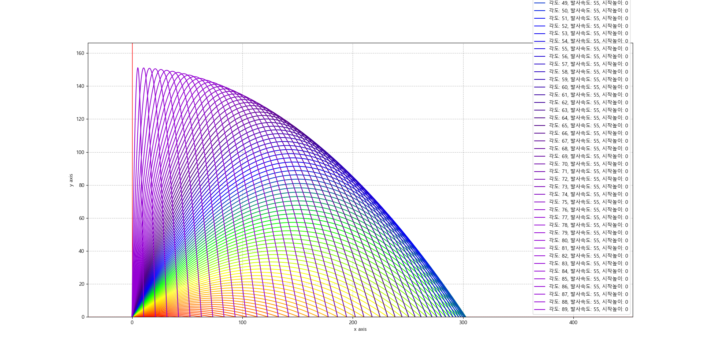
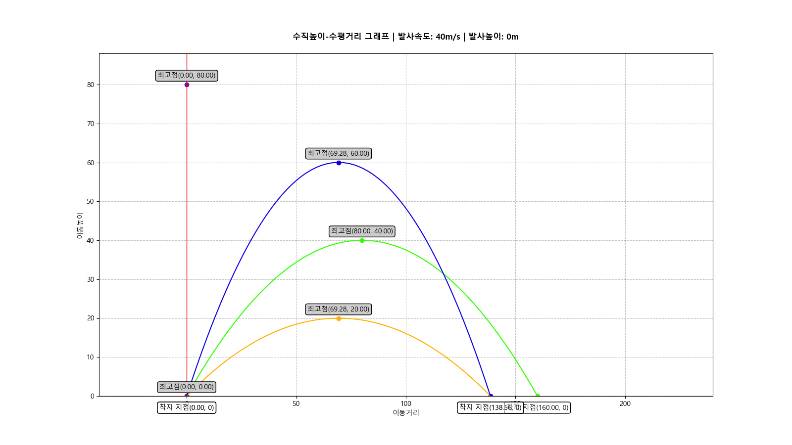

# Parabola visualization

발사각도에 따른 물체의 포물선 궤적 변화를 통해 이차원 평면상에서 수평이동거리-수직이동거리, 각도-이동높이, 각도-이동거리를 그리기 위한 프로그램임.

## 발사각도별 전체 수평 이동거리 - 수직 이동거리 그래프

 | 

## 발사각도별(0도 30도 45도 60도 90도) 수평 이동 거리 - 수직 이동 거리 그래프

지면에서 발사한 경우, 최대 수직 도달 거리는 90도(수직 발사) 일때이며, 최대 수평 도달 거리는 45도 임을 알 수 있다.

## 각도-이동거리 0-90, 0-180 그래프

지면에서 발사한 경우, 각이 45도 일 때, 135도 일 때 최대 이동 거리를 도달한다.
앞을 +방향, 뒤를 -방향이라고 할때, 45는 앞으로 가장 멀리 날아갈 때, 135도는 뒤로 가장 멀리 날아갈 때이다.
|90도|180도|
|:---:|:---:|
|||
|||

## 각도-이동높이 0-90, 0-180 그래프

지면에서 발사한 경우, 각이 90도일 때 최대 높이를 도달한다. 또한 지면에서 발사하기 때문에 0도와 180도(수평발사)는 수평 도달 거리가 0이며, 181~360도는 지하로 발사하기 때문에 고려하지 않았다.

|90도|180도|
|:---:|:---:|
|||
|||
